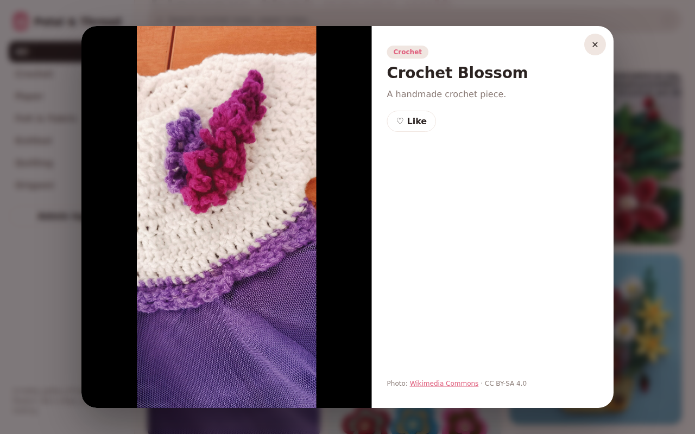
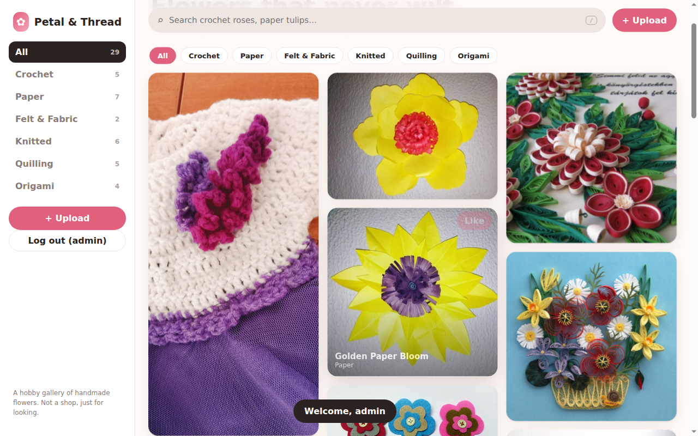

# Petal & Thread — Handmade Flower Gallery

A Pinterest-style gallery for showing off handmade flowers: crochet, paper, felt, knitted, quilling, origami and more.
It is a **display site only**. Nothing is sold, and there is no cart or checkout.

- **Visitors** can browse, search, filter by category, like pins and open them in a viewer.
- **The admin** logs in with a password and can **upload** images or videos, **edit** products and **delete** them.
- Products are stored on the server, so every visitor sees the same gallery.



---

## Using the website

### As a visitor
| What | How |
|---|---|
| Browse | Scroll the masonry grid. Cards fade in as they load. |
| Search | Type in the search bar at the top (press `/` to jump to it). It matches titles, categories and descriptions. |
| Filter | Click a category in the sidebar or a chip above the grid. On phones, open the sidebar with the ☰ menu button. |
| View a product | Click a card to open it full-size. Videos play in the viewer. |
| Like | Click **Like** on a card or in the viewer. Liked pins get their own "♥ Liked" category in the sidebar. Likes are saved in your own browser only. |

Visitors never see Upload, Edit or Delete buttons. The server also rejects those actions without an admin login.

### As the admin
1. Click **Admin login** in the sidebar, below the categories.
2. **First time only:** the site asks you to *create* the admin password (at least 8 characters).
   Do this right after deploying, **before** sharing the link, because the first person to open Admin login sets the password.
3. After you log in you will see:
   - **+ Upload** (in the sidebar and the top bar): drag and drop (or pick) an image or video (max 50 MB), add a title, category and description, then save.
   - **Edit**: open a product, click *Edit*, change the text or replace the media.
   - **Delete**: open a product and click *Delete*.
4. Click **Log out (admin)** when you're done. Logins expire after 7 days.



**Forgot the password?** Stop the app, delete `auth.json` from the data folder (see below), then start the app again. The next Admin login will ask you to create a new password. Your products are kept.

---

## Running it on your computer

You need Python 3.10 or newer.

```bash
git clone https://github.com/BuiDinhTuyen24/flower-website.git
cd flower-website
pip install -r requirements.txt
uvicorn app.main:app --reload --port 8000
```

Then open http://localhost:8000.

Or run it with Docker:

```bash
docker build -t flower-website .
docker run -p 8000:8000 -v flower-data:/data flower-website
```

### Where data is stored
All data lives in one folder:

| File | Contents |
|---|---|
| `pins.json` | The product list. It is created on first start with 29 sample flowers. |
| `uploads/` | Uploaded images and videos. |
| `auth.json` | The admin password hash and login signing key. **Keep this private.** |

The folder is chosen in this order: the `DATA_DIR` environment variable, then `/data` if it exists, then `./data` in the project folder.
`data/` is in `.gitignore`, so it is never committed.

---

## Project structure

```
app/
  main.py            FastAPI server: API, admin auth, file uploads
  static/
    index.html       Page layout (sidebar, search bar, grid, modals)
    styles.css       Masonry layout, animations, mobile and dark mode
    app.js           Frontend logic (search, filters, viewer, admin tools)
    data.js          The 29 sample products (Wikimedia Commons images)
Dockerfile           Container image for deployment
requirements.txt     Python dependencies
pyproject.toml       Same dependencies, in pyproject format
```

### API
| Method | Path | Who |
|---|---|---|
| GET | `/api/pins` | Everyone |
| GET | `/api/me` | Everyone (tells the page whether you are admin) |
| POST | `/api/setup` | First-time password creation |
| POST | `/api/login` | Admin login, returns a token |
| POST | `/api/pins` | Admin: upload a product (multipart form) |
| PUT | `/api/pins/{id}` | Admin: edit a product |
| DELETE | `/api/pins/{id}` | Admin: delete a product |
| POST | `/api/password` | Admin: change password (`{"current": "...", "new": "..."}`) |

Admin requests send `Authorization: Bearer <token>`.

---

## Next step: deploying it (to be done by a human)

The site is **one Python web app** that serves both the pages and the API.
It needs a host that runs a long-lived server **with a persistent disk**, because uploads and the product list are saved as files.
Without a persistent disk, every redeploy or restart wipes the uploads and the admin password.

> ⚠️ **Vercel, Netlify and Lovable are not a good fit as-is.** They run serverless functions with a read-only or temporary filesystem, so uploads would vanish.
> To use them you would need to move storage to a database plus file storage (for example Supabase, or Vercel Blob + Postgres).

### Option A — Render (easy, web dashboard)
1. Sign in at https://render.com with GitHub.
2. **New → Web Service** → pick this repo. Render detects the `Dockerfile`.
3. Choose a plan that supports disks (persistent disks are not available on Render's free tier).
4. **Advanced → Add Disk**: mount path `/data`, size 1 GB.
5. Click **Create Web Service**. When it's live, open the URL and set the admin password straight away.

### Option B — Fly.io (command line)
```bash
# install flyctl: https://fly.io/docs/flyctl/install/
fly auth login
fly launch --no-deploy            # uses the Dockerfile; pick a name and region
fly volumes create flower_data --size 1
```
Add this to the generated `fly.toml`:
```toml
[mounts]
  source = "flower_data"
  destination = "/data"

[http_service]
  internal_port = 8000
```
Then:
```bash
fly deploy
```
Keep it to **one machine** (`fly scale count 1`), because the data is on a single volume.

### Option C — Railway
1. **New Project → Deploy from GitHub repo** → pick this repo (it builds from the `Dockerfile`).
2. Add a **Volume** to the service, mounted at `/data`.
3. Under **Settings → Networking**, click **Generate Domain**.

### After deploying (any host)
1. Open the site → **Admin login** → create a strong password.
2. Upload a test image and a short test video, then check that they appear in another browser or a private window.
3. Restart or redeploy the app once, and check that the uploads are still there. That proves the disk is persistent.
4. Back up the `/data` folder now and then.

### Ideas for later
- Login rate limiting, to slow down password guessing
- Moving to a database plus object storage (Postgres + S3, or Supabase) for bigger galleries or serverless hosting
- More than one admin account

---

## Credits
The sample photos come from [Wikimedia Commons](https://commons.wikimedia.org). Each photo's license and author link is shown in its viewer.
